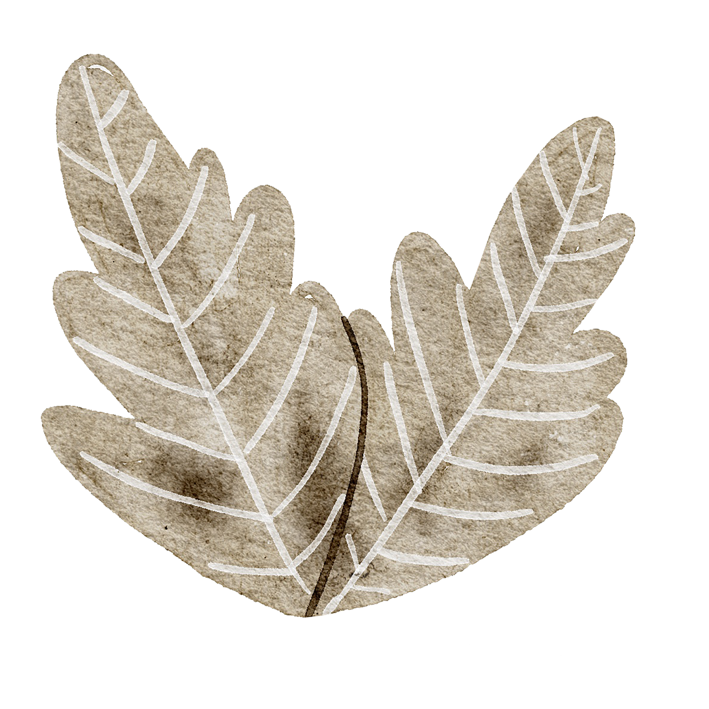

# Olá! É um prazer tê-lo aqui.

  
  
  

    Meu nome é <b>Taylana</b> e sou estudante de <b>Ciência da Computação</b>. Desde cedo, sou apaixonada por design, mas ao explorar o <b>back-end</b>, descobri um novo amor por entender as nuances do desenvolvimento de software. Estou comprometida em aprimorar minhas habilidades nessa área. 
    Acredito que a tecnologia tem o poder de nos conectar, mesmo quando estamos em diferentes lugares e contextos. Com esforço e dedicação, sonho em contribuir para que essa acessibilidade se torne uma realidade concreta, não apenas uma teoria.
  

### 🌱 Habilidades que Estou Aprendendo

   

### 📬 Contatos

[](htt

